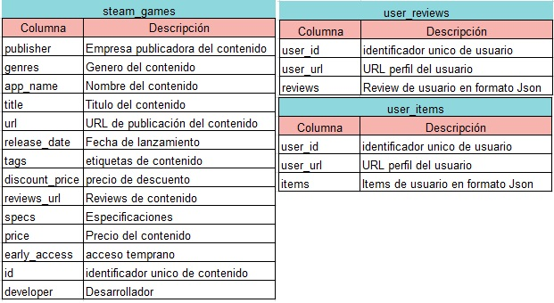

# PI_MLOps

<h2 align="center">Proyecto Individual N°1</h2>

<h3 align="center">Machine Learning Operations (MLOps)</h3>

<h2 align="center">Bruno Zenobio, DATAFT16</h2>

---

## Tabla de Contenidos

- [Introducción](#introducción)
- [Desarrollo del Estudio](#desarrollo-del-estudio)

---

<h1 align="center">Introducción</h1>

En este proyecto, llevaremos a cabo un estudio basado en Machine Learning Operations (MLOps). Este estudio se divide en tres etapas principales:

1. **Exploración y Transformación:** Se realizará un análisis exploratorio de los datos, incluyendo la exploración de distribuciones y detección de correlaciones y valores atípicos.

2. **Preparación de Datos:** Se prepararán los datos para comprender las relaciones entre las variables y construir modelos sobre ellos. También se crearán funciones para consultas a los datos, consumibles a través de una API.

3. **Modelado:** Se desarrollarán modelos de Machine Learning para entender relaciones y predecir correlaciones entre variables.

Los datos utilizados incluyen información sobre juegos en la plataforma Steam y la interacción de los usuarios con estos juegos.

<h2 align="center">Diccionario de los Datos</h2>

---

<h1 align="center">Desarrollo del Estudio</h1>

### ETL y EDA

#### `steam_games`

- Se eliminaron filas completamente nulas y se corrigieron duplicados en el ID.
- Se completaron nulos de columnas con otras columnas y se normalizó la columna de precio.
- Las variables nulas en precio (menos del 4%) se eliminaron; otras filas con valores nulos se eliminaron también.
- Se crearon variables ficticias (dummies) para el análisis y se eliminaron columnas no utilizadas.

  **Gráficos:**
  - Diagrama de Caja para visualizar la distribución de precios.
  - Gráfico de Barras para mostrar la cantidad de juegos gratis por año.

#### `user_reviews`

- Se eliminaron filas con valores nulos en la columna de "reviews".
- Se creó una nueva columna llamada 'sentiment_analysis' usando análisis de sentimiento y se eliminó la columna de review.

  **Gráficos:**
  - Gráfico de Barras para mostrar la distribución del sentimiento positivo, separado por recomendación del juego.
  - Diagrama de Dispersión para visualizar la relación entre precio y cantidad de ítems del usuario en un juego.

#### `user_items`

- Se eliminaron filas con valores nulos en la columna de "items".

  **Gráficos:**
  - Diagrama de Dispersión para visualizar la relación entre precio y cantidad de ítems del usuario en un juego.

### Funciones para la API

- `developer(desarrollador: str)`: Retorna la cantidad de ítems y el porcentaje de contenido gratis por año para un desarrollador dado.
- `userdata(User_id: str)`: Retorna el dinero gastado, cantidad de ítems y el porcentaje de comentarios positivos en la revisión para un usuario dado.
- `UserForGenre(género: str)`: Retorna al usuario que acumula más horas para un género dado y la cantidad de horas por año.
- `best_developer_year(año: int)`: Retorna los tres desarrolladores con más juegos recomendados por usuarios para un año dado.
- `developer_rec(desarrolladora: str)`: Retorna una lista con la cantidad de usuarios con análisis de sentimiento positivo y negativo para un desarrollador dado.

